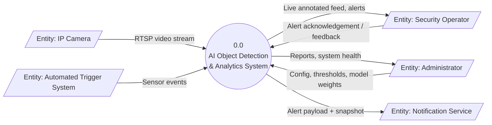
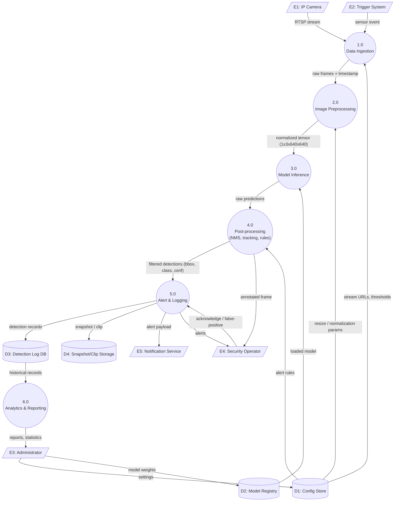
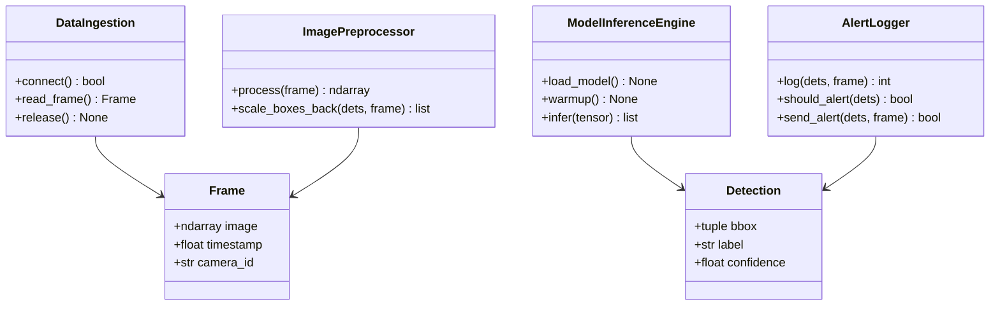

# System Design Specification: AI Smart Surveillance & Attendance System

**Course:** AI Project Design and Development (AI-316)
**Lab:** 02 – System Requirements & Software Architecture for AI Projects
**University:** Air University Islamabad, Department of Creative Technologies
**Student:** _<Name / Reg. No.>_

---

## Table of Contents
1. [Functional & Non-Functional Requirements (Task 1)](#1-requirements)
2. [System Boundary, Actors & I/O Mapping (Task 2)](#2-system-boundary-actors--inputoutput-mapping)
3. [Data-Flow Diagrams (Task 3)](#3-data-flow-diagrams)
4. [Modular Software Architecture (Task 4)](#4-modular-software-architecture)
5. [Repository Structure](#5-repository-structure)

---

## 1. Requirements

**Case study:** Smart Automated Attendance System (face detection + recognition on classroom cameras).

### 1.1 Functional Requirements

| ID | Requirement | Description | Acceptance Criterion |
|----|-------------|-------------|----------------------|
| FR-01 | Face Detection | The system shall detect all faces in each processed frame. | Detection latency ≤ 50 ms per frame on the edge device |
| FR-02 | Face Recognition | The system shall match each detected face against enrolled student embeddings. | Top-1 match with cosine similarity ≥ 0.60 |
| FR-03 | Attendance Logging | The system shall record student ID, timestamp, camera ID and confidence for each recognized student, once per class session. | No duplicate entries per student per session |
| FR-04 | Database Synchronization | The system shall sync local attendance records to the central database. | Sync within 30 s of connectivity; offline queue retained |
| FR-05 | Reporting & Manual Override | The system shall let an Admin/Instructor view reports and correct attendance manually. | Export to CSV/PDF; all edits audit-logged |

### 1.2 Non-Functional Requirements

| ID | Category | Requirement | Measurable Target |
|----|----------|-------------|-------------------|
| NFR-01 | Performance | Minimum processing frame rate | ≥ 15 FPS end-to-end |
| NFR-02 | Accuracy | Model accuracy thresholds | Face detection mAP@0.5 ≥ 0.90; recognition accuracy ≥ 95%; false accept rate ≤ 1% |
| NFR-03 | Power / Resources | Edge device power usage | ≤ 15 W average (e.g., Jetson Nano class); RAM ≤ 4 GB |
| NFR-04 | Security & Privacy | Data privacy | Embeddings encrypted at rest (AES-256), TLS 1.2+ in transit, no raw video stored beyond 24 h, consent-based enrollment |
| NFR-05 | Reliability & Scalability | Availability and scale | 99% uptime during class hours; supports ≥ 4 concurrent camera streams; auto-recovery from stream drop within 10 s |

---

## 2. System Boundary, Actors & Input/Output Mapping

**Case study:** AI-powered surveillance application (people/object detection with alerts).

### 2.1 System Actors

| Actor | Type | Role | Interaction |
|-------|------|------|-------------|
| Security Operator | Human (primary) | Monitors live feeds, acknowledges alerts | Dashboard, alert console |
| System Administrator | Human (primary) | Configures cameras, models, thresholds, users | Admin panel, config files |
| Automated Trigger System | External system | Sends events (door sensor, motion sensor) to start/prioritize analysis | MQTT / REST |
| IP Camera | Hardware | Supplies video stream | RTSP |
| Notification Service | External system | Delivers SMS/email/push alerts | HTTPS API |

### 2.2 System Inputs

| Input | Source | Format / Parameters |
|-------|--------|---------------------|
| Video stream | IP camera | RTSP, H.264/H.265, 1920×1080 @ 25–30 FPS (downscaled to 640×640 for inference) |
| Sensor parameters | Motion/door sensors | JSON: `{sensor_id, event, timestamp}` |
| Configuration | Administrator | YAML: confidence threshold (default 0.5), NMS IoU (0.45), ROI polygons, alert rules |
| Model weights | Admin / model registry | ONNX / TensorRT (`.onnx`, `.engine`) |
| Operator feedback | Security Operator | Alert acknowledge / false-positive flag |

### 2.3 System Outputs

| Output | Destination | Format |
|--------|-------------|--------|
| Bounding boxes | Overlay on dashboard, database | `[x1, y1, x2, y2, class, confidence]` (pixels) |
| Alert notifications | Operator, Notification Service | JSON + snapshot JPEG; channels: push/SMS/email |
| Log entries | Log store / DB | `timestamp, camera_id, class, conf, bbox, alert_level` |
| Analytics reports | Admin | Counts per class/hour, heatmaps (CSV/PDF) |
| Annotated clips | Storage | MP4, 10 s pre/post event |

### 2.4 Operational Constraints

| Constraint | Limit |
|------------|-------|
| Maximum memory footprint | ≤ 4 GB RAM, ≤ 2 GB GPU memory (model + buffers) |
| Bandwidth | ≤ 4 Mbps per camera stream; ≤ 1 Mbps upstream for alerts/metadata (only snapshots uploaded, not full video) |
| Inference latency | ≤ 100 ms per frame end-to-end |
| Storage | Rolling 7-day video buffer; 90-day metadata retention |
| Hardware | Edge device with GPU/NPU; no cloud dependency for inference |
| Compliance | Camera zones signposted; access restricted by role (RBAC) |

---

## 3. Data-Flow Diagrams

### 3.1 Level 0 – Context Diagram



### 3.2 Level 1 DFD



**Legend:** parallelogram = external entity, circle = process, cylinder = data store, arrow = data flow.

---

## 4. Modular Software Architecture

### 4.1 Module Responsibilities

| Module | Responsibility | Input | Output |
|--------|----------------|-------|--------|
| `DataIngestion` | Connect to RTSP/video source, grab frames, reconnect on failure | Source URI | `Frame` objects |
| `ImagePreprocessor` | Resize (letterbox), color convert, normalize, batch | `Frame` | `np.ndarray` tensor (1,3,H,W) |
| `ModelInferenceEngine` | Load model, run inference, decode + NMS | Tensor | `list[Detection]` |
| `AlertLogger` | Evaluate rules, log detections, dispatch alerts | `list[Detection]` | `bool` / log record IDs |

### 4.2 Class Specifications

| Class | Method | Parameters | Returns |
|-------|--------|-----------|---------|
| `DataIngestion` | `connect()` | – | `bool` |
| | `read_frame()` | – | `Optional[Frame]` |
| | `release()` | – | `None` |
| `ImagePreprocessor` | `process(frame)` | `Frame` | `np.ndarray` |
| | `scale_boxes_back(boxes, frame)` | `list[Detection]`, `Frame` | `list[Detection]` |
| `ModelInferenceEngine` | `load_model()` | – | `None` |
| | `infer(tensor)` | `np.ndarray` | `list[Detection]` |
| | `warmup()` | – | `None` |
| `AlertLogger` | `log(detections, frame)` | `list[Detection]`, `Frame` | `int` (records written) |
| | `should_alert(detections)` | `list[Detection]` | `bool` |
| | `send_alert(detections, frame)` | `list[Detection]`, `Frame` | `bool` |

Skeleton code is in [`src/`](src/) (`interfaces.py`, `data_ingestion.py`, `image_preprocessor.py`, `model_inference_engine.py`, `alert_logger.py`, `pipeline.py`).

### 4.3 Class Diagram



---

## 5. Repository Structure

```
project/
├── ARCHITECTURE.md
├── requirements.txt
└── src/
    ├── interfaces.py
    ├── data_ingestion.py
    ├── image_preprocessor.py
    ├── model_inference_engine.py
    ├── alert_logger.py
    └── pipeline.py
```

### Requirement Traceability

| Requirement | Satisfied By |
|-------------|--------------|
| FR-01, NFR-01, NFR-02 | `ImagePreprocessor` + `ModelInferenceEngine` |
| FR-03, FR-04 | `AlertLogger` |
| Stream resilience (NFR-05) | `DataIngestion.connect()` retry logic |
| Privacy (NFR-04) | `AlertLogger` (encrypted storage, retention policy) |
