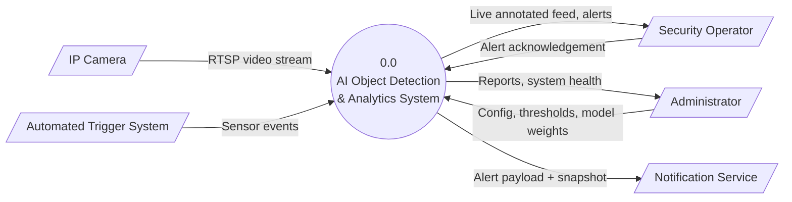

# Smart Surveillance System Design

**Course:** AI Project Design and Development (AI-316) | **Lab 02**
**Air University Islamabad, Department of Creative Technologies**
**Student:**
NOOR UL EMAN (231197)

System requirements and software architecture for an AI-powered surveillance and attendance system.

## Contents

| File / Folder | Description |
|---------------|-------------|
| [`ARCHITECTURE.md`](ARCHITECTURE.md) | Full System Design Specification (requirements, I/O mapping, DFDs, class design) |
| [`src/`](src/) | Skeleton Python modules: DataIngestion, ImagePreprocessor, ModelInferenceEngine, AlertLogger |
| `requirements.txt` | Python dependencies |

## System Context Diagram (Level 0 DFD)



## Pipeline

`DataIngestion` → `ImagePreprocessor` → `ModelInferenceEngine` → `AlertLogger`

See [`ARCHITECTURE.md`](ARCHITECTURE.md) for the Level 1 DFD, requirement tables and class specifications.

## Quick Check

```bash
pip install -r requirements.txt
cd src
python -c "import interfaces, data_ingestion, image_preprocessor, model_inference_engine, alert_logger; print('All modules OK')"
```

> Note: modules are interface skeletons; methods raise `NotImplementedError` by design.
